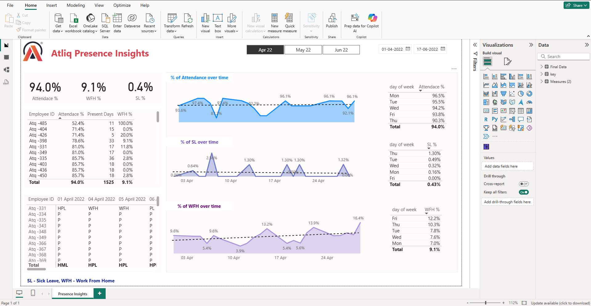

# HR Analytics Dashboard – Power BI

## Dashboard Preview

## Project Overview
This project focuses on analyzing employee attendance and workforce trends using Power BI. The dashboard provides insights into presence percentage, work-from-home trends, and leave utilization to support HR decision-making.

## Dataset
- Attendance-Sheet-2022-2023.xlsx

## Tools & Technologies
- Power BI
- Power Query
- DAX
- Excel
- Data Visualization

## Key KPIs
- Presence %
- Work From Home %
- Leave %
- Employee Attendance Trend
- Monthly Workforce Analysis

## Dashboard Features
- Attendance trend analysis
- Work-from-home vs office insights
- Department-wise performance
- Leave utilization tracking
- Interactive slicers and filters
- Dynamic KPI cards

## Business Insights
- Identified attendance patterns across months
- Analyzed remote work trends
- Detected high leave utilization periods
- Highlighted workforce availability trends

## Files Included
- HR-Analytics-Atliq.pbix
- Attendance-Sheet-2022-2023.xlsx

## Outcome
Built an interactive HR dashboard to help organizations monitor employee attendance and improve workforce planning using data-driven insights.
